# 抖音黑科技AI引流获客软件

### Deeke官网
> <a href="https://deeke.cn">https://deeke.cn（可获取报价）</a>
>
> <a href="https://www.deeke.cn/blog/deeke-tutorial">点击这里，立即试用</a>
---

> 最新版本在这：<a href="https://github.com/DeekeScript/ad-deeke">https://github.com/DeekeScript/ad-deeke</a>

> 我们自主研发的DeekeScript底层框架已上线：<a href="https://doc.deeke.cn" target="_blank">点击查看</a>

---

### 我们的优势
- 具备底层框架研发能力（自主研发的DeekeScript框架）
- 具备产品研发能力，能解决行业尖端问题
- 支持各平台定制
- 产品稳定性、流畅度行业领先，贴牌遍布全国各地
- 团队成员多，有丰富的产品经验
- 产品持续更新

### 管理员后台展示

    后台主要采用PHP的thinkPHP框架开发，页面采用的是antd Pro开发，后台主要涉及到以下模块：

    1.用户管理：查看平台下的所有用户数据
    2.代理商管理：查看平台下的所有代理商数据
    3.设备管理：查看平台下的所有设备
    4.群控管理：一键采集抖音用户手机号（手机运行本程序打包的APP采集，非接口采集），以及采集数据管理
    5.日志管理：APP运行日志管理
    6.系统管理：APP列表（上传APP包）

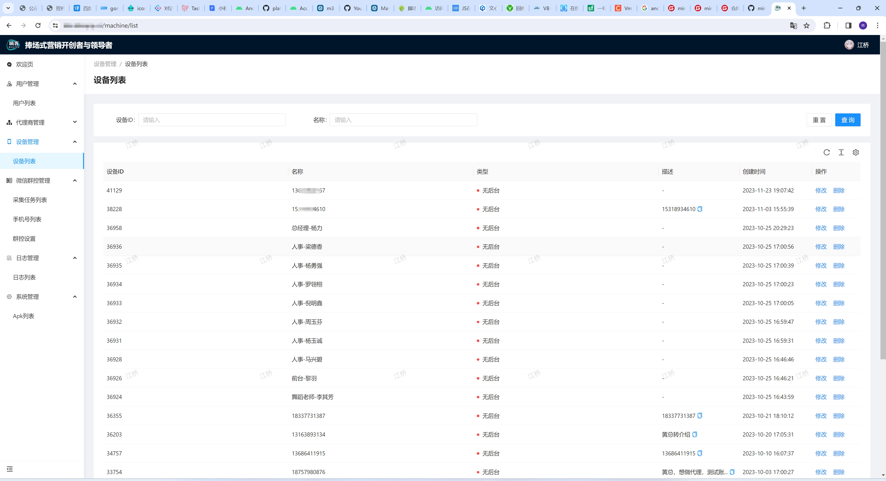

### 代理商后台展示

    后台主要采用PHP的thinkPHP框架开发，页面采用的是antd Pro开发，后台主要涉及到以下模块：

    1.用户管理：查看平台下的所有用户数据
    2.代理商管理：查看平台下的所有代理商数据
    3.设备管理：查看平台下的所有设备
    4.群控管理：一键采集抖音用户手机号（手机运行本程序打包的APP采集，非接口采集），以及采集数据管理
    5.日志管理：APP运行日志管理
    6.系统管理：APP列表（上传APP包）

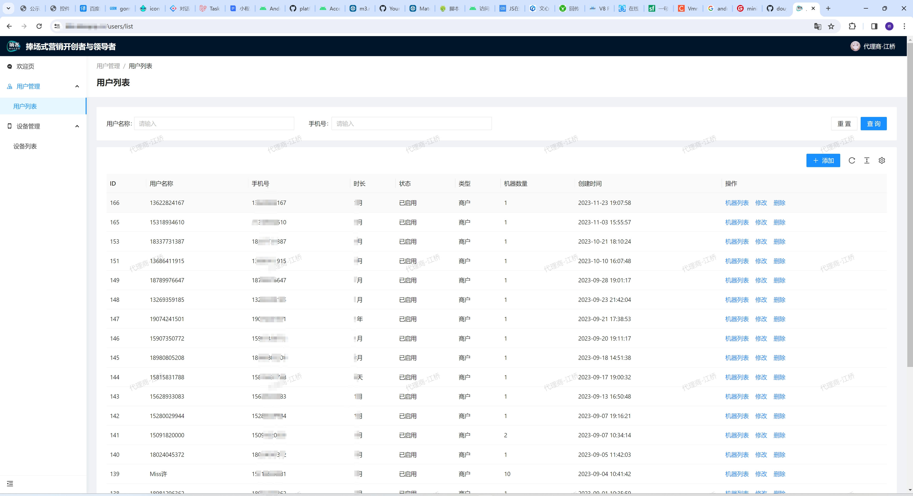

### APP展示

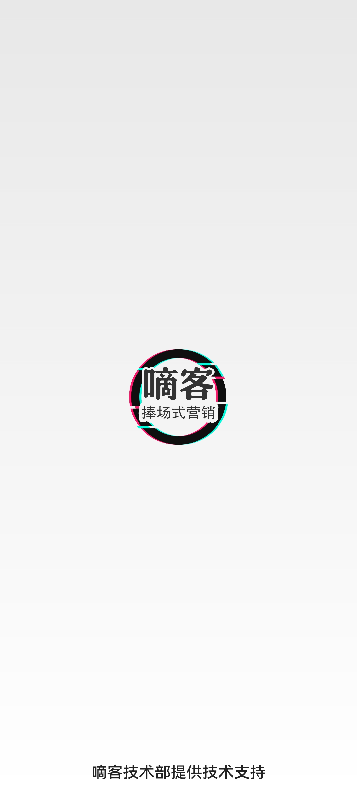
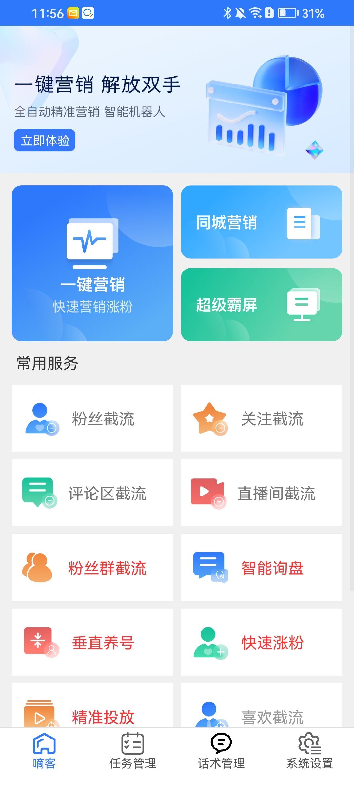
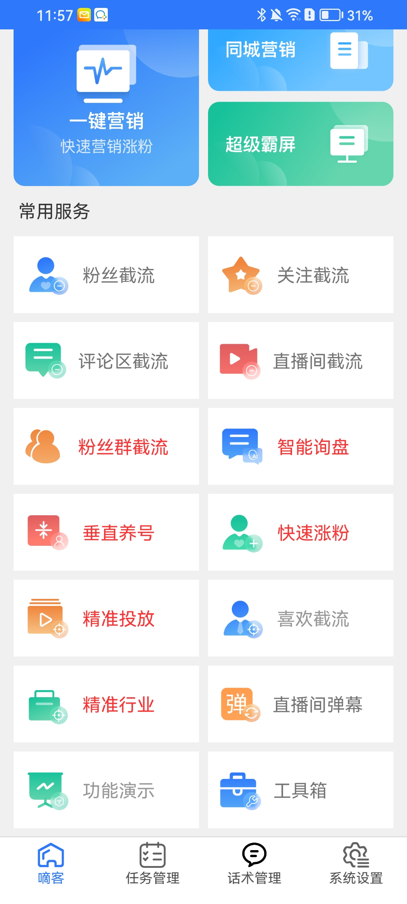
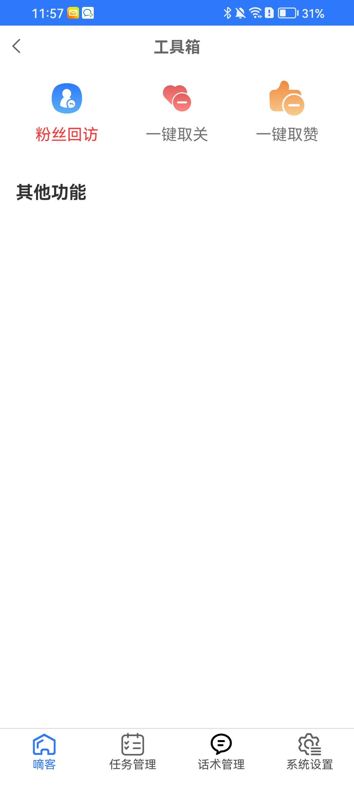
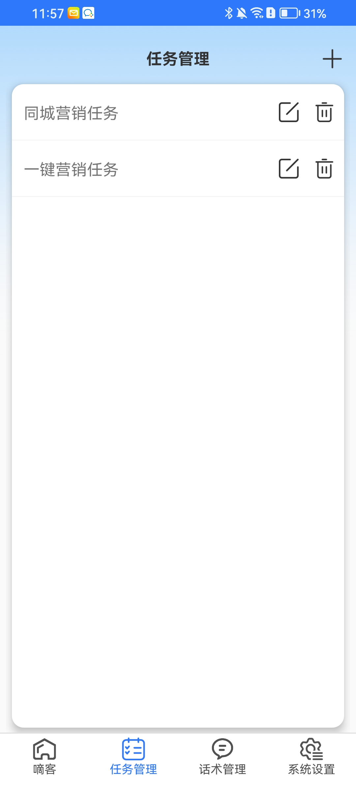
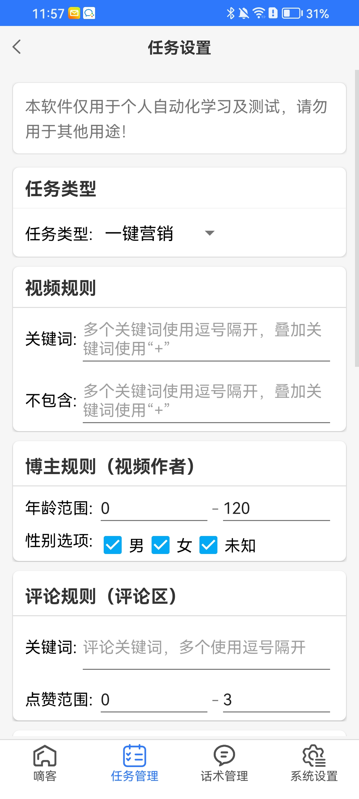
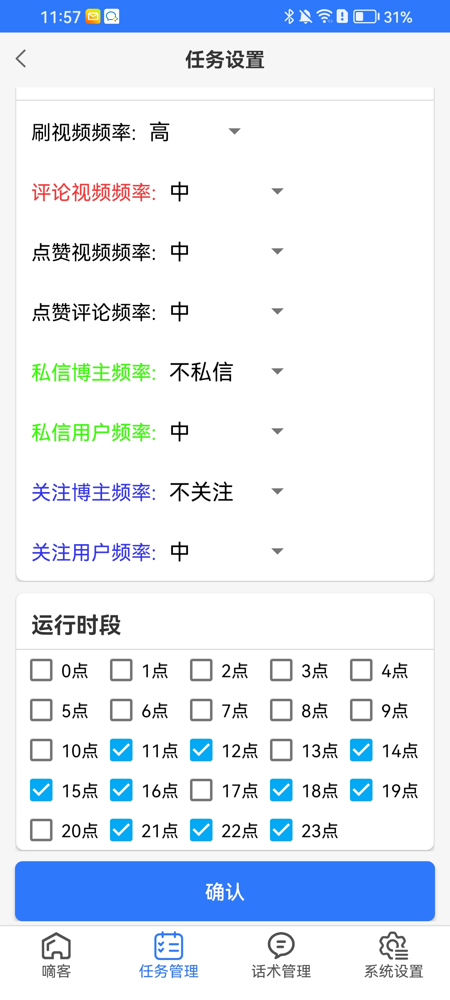
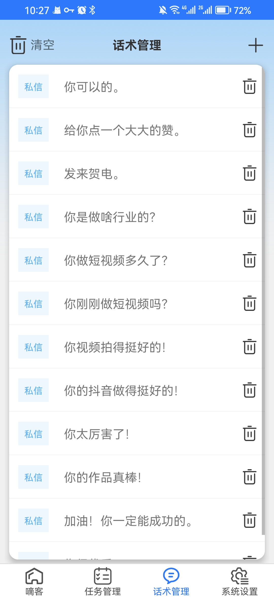
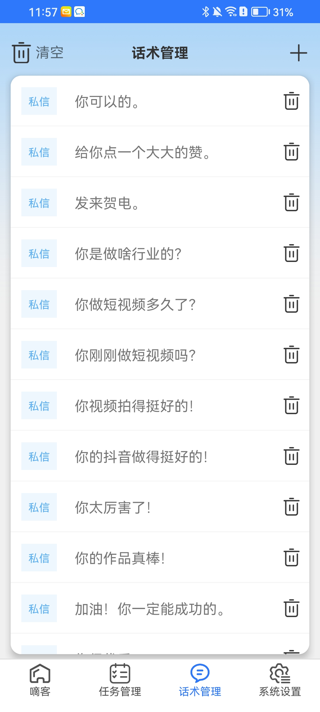
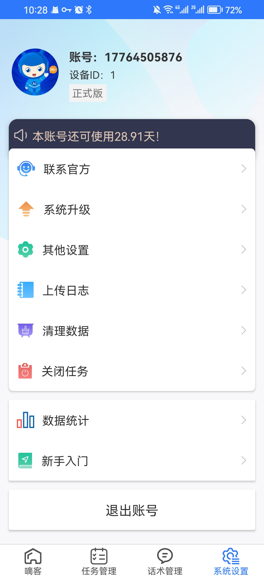
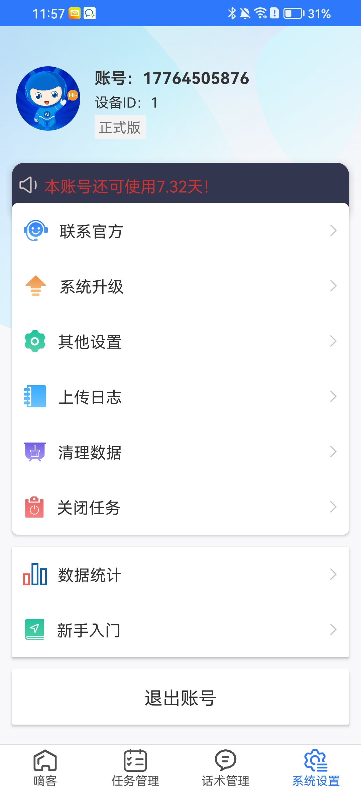
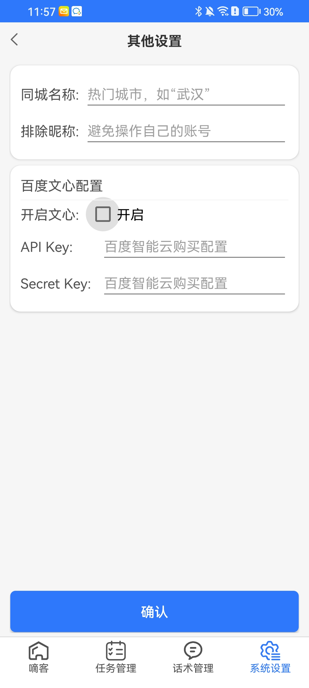

### 贴牌APP展示【目前已贴牌30+，分布全国各地】

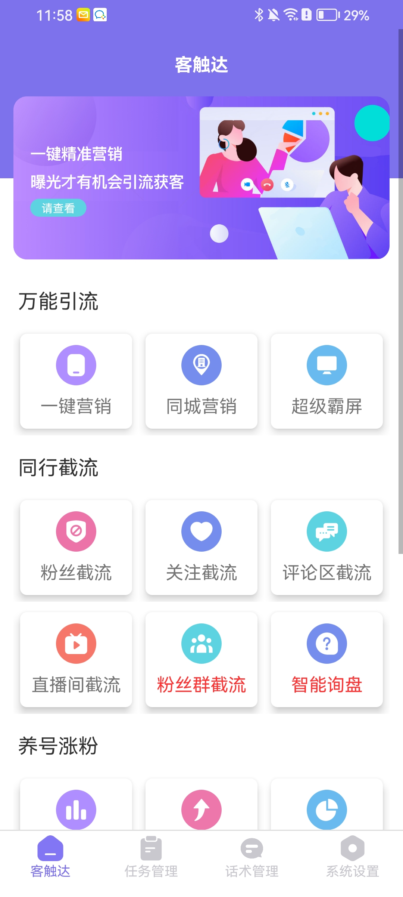
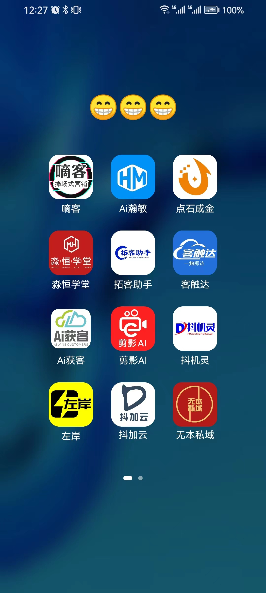

### 系统部署说明【需要源代码的请联系V：15807197051】

    系统核心文件夹架构如下：
        docker-linux         线上部署的docker-compose.yaml文件
        nginx
        mysql
           cert               Nginx的证书文件
           conf.d             nginx的配置文件，里面有一个配置文件可以作为参考
           html
              antd            后台页面文件（打包后的文件，需要源文件，请联系我本人）
              apk             打包成apk的js文件，需要打包工具的，请联系商务或者作者
              php             后台的接口，采用thinkphp
        php                   PHP的配置文件
        redis                 Redis配置文件
        docker-compose.yaml   构建系统的核心文件

    接下来，请执行如下步骤：（下面的过程中可能会因为环境的不同出现不同的问题，需要自行解决，如果无法解决，请联系作者本人）
        1.下载docker
        2.获取本仓库代码
        3.填写各个配置文件【请阅读配置文件】
        4.进入docker-compose.yaml所在文件夹，执行：  docker compose up -d
        5.执行“docker ps -a”可以看到 nginx、PHP、mysql、Node都已启动
        6.如果各个配置都正确，这个时候访问你的域名，应该就能看到登录界面，如下：

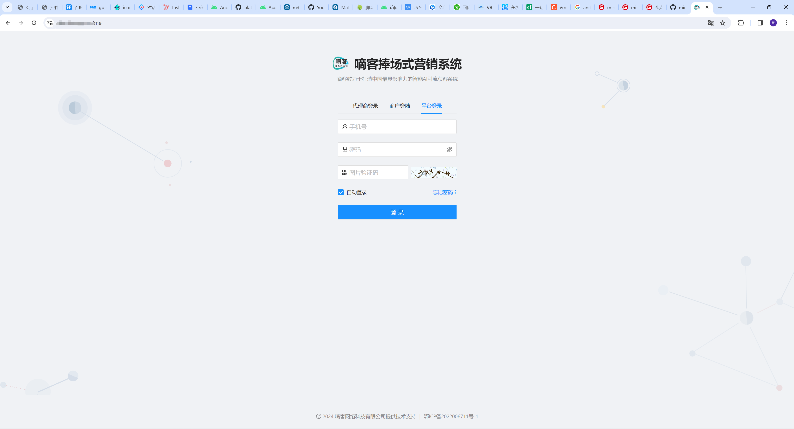

### 如果需要查看后台页面，请访问以下地址：

请联系商务或者作者

### 配置文件

PHP需要的配置，可以在.env里面配置

### 如需咨询相关业务，请联系作者：

